# BiG-RAG: Bipartite Graph RAG with Reinforcement Learning

**BiG-RAG** (Bipartite Graph Retrieval-Augmented Generation) is an advanced RAG framework that uses bipartite graph structures and reinforcement learning to enhance reasoning capabilities.

> **Note**: This project was originally published as **Graph-R1** [[paper](https://arxiv.org/abs/2507.21892)]. The implementation has been rebranded to **BiG-RAG** to accurately reflect the underlying bipartite graph architecture (as opposed to the hypergraph terminology used in the original paper).


## Overview

<div align="center">
  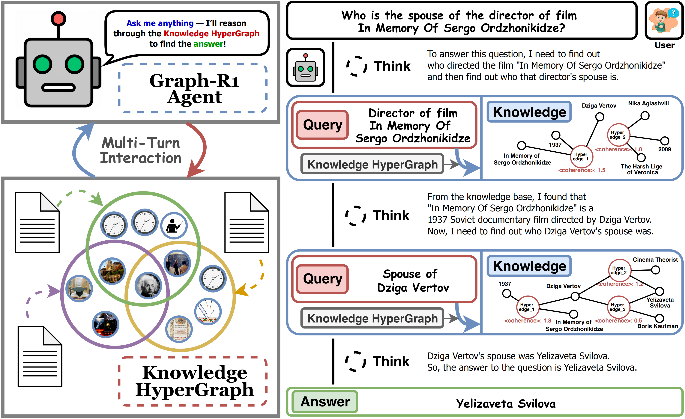
</div>

Recently, the **GraphRAG** method effectively addresses the data silos issue, significantly enhancing knowledge retrieval efficiency. Nevertheless, the disconnect between graph-structured knowledge and language modalities continues to constrain performance.

To bridge this gap, **BiG-RAG** implements an **end-to-end reinforcement learning (RL)** framework designed to improve **reasoning-on-graph capabilities** of large language models (LLMs). 

<div align="center">
  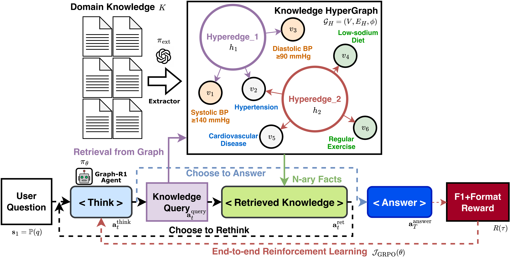
</div>

Specifically, BiG-RAG constructs a **bipartite knowledge graph** using **n-ary relation extraction**. We then employ an explicit reward mechanism within RL, enabling the LLM to iteratively execute a "**think–generate query–retrieve subgraph–rethink**" reasoning cycle. This iterative approach enables the model to effectively leverage graph knowledge to produce high-quality answers.

By integrating structured knowledge into LLM reasoning more flexibly via reinforcement learning, BiG-RAG holds promise for applications in **knowledge-intensive fields** such as healthcare, finance, and law.

## Experimental Results
**Results on Different RL Algorithms:**
<table>
  <tr>
    <td>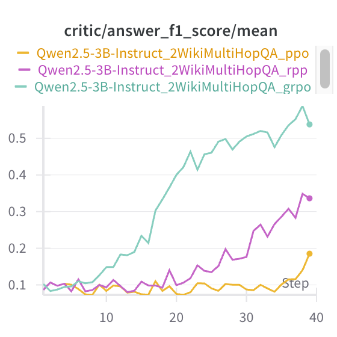</td>
    <td>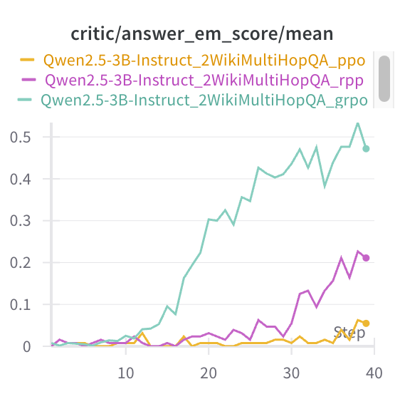</td>
    <td></td>
    <td>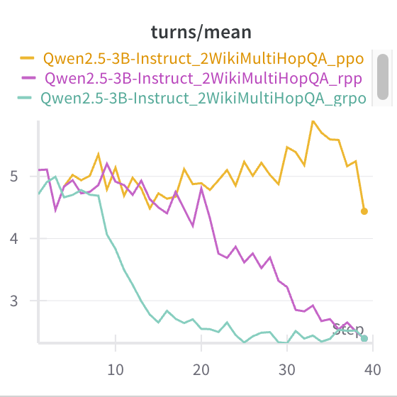</td>
  </tr>
</table>

**Results on Different GraphRAG Datasets:**
<table>
  <tr>
    <td>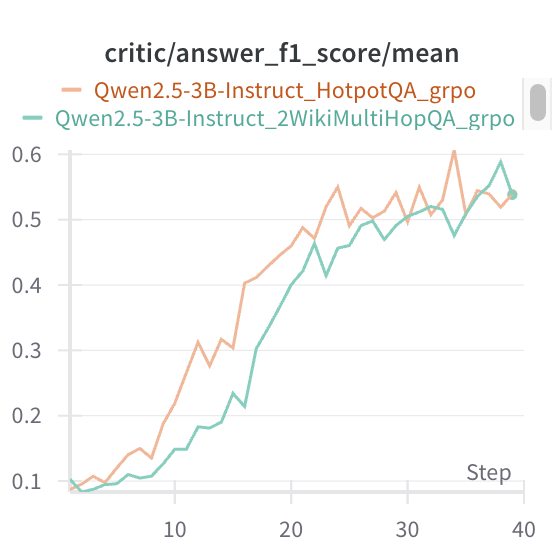</td>
    <td>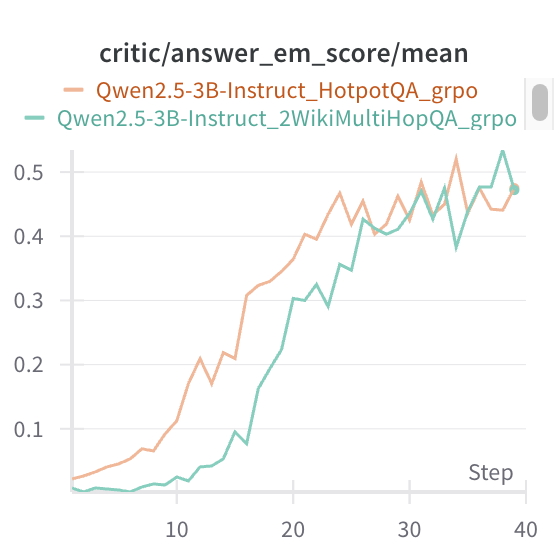</td>
    <td>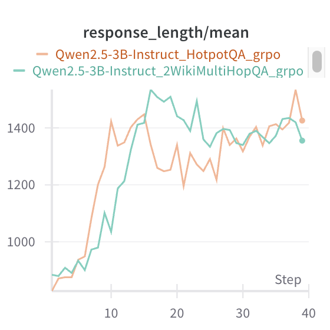</td>
    <td>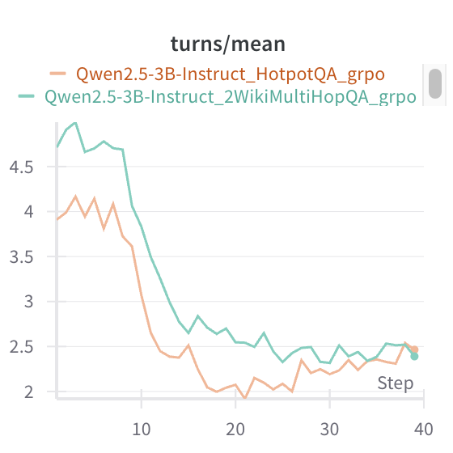</td>
  </tr>
</table>

**Results on Different Parameter Scale of LLM:**
<table>
  <tr>
    <td>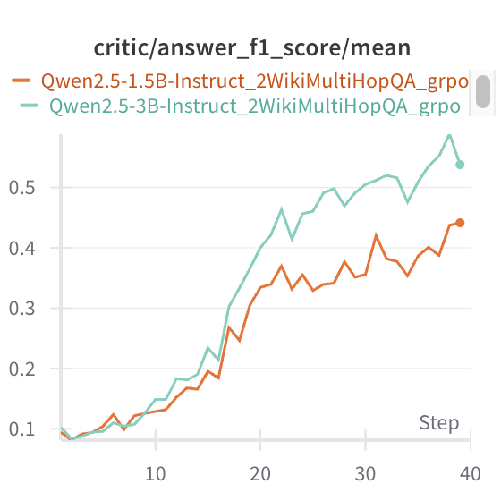</td>
    <td>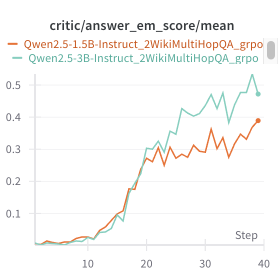</td>
    <td>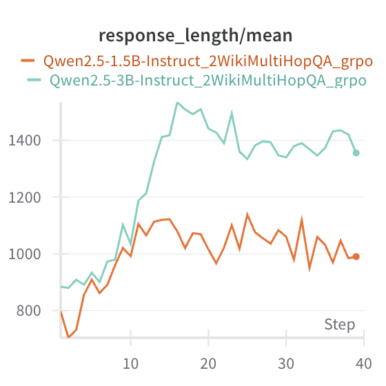</td>
    <td>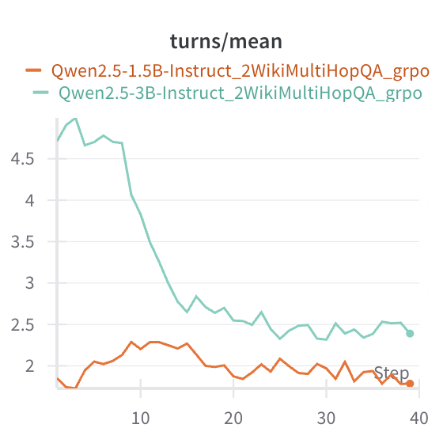</td>
  </tr>
</table>

## Documentation

### Core Documentation

- **[README.md](README.md)** - This file: Project overview and quick start guide
- **[CHANGELOG.md](CHANGELOG.md)** - Complete change history: rebranding and bug fixes
- **[DEVELOPMENT_NOTES.md](DEVELOPMENT_NOTES.md)** - Technical details, architecture, and developer guidance
- **[CLAUDE.md](CLAUDE.md)** - AI agent development reference (for Claude Code)
- **[SETUP_VENV.md](SETUP_VENV.md)** - Python venv setup guide (lightweight mode)

### Coming Soon

The following components will be published when the RL training framework is fully ready:
- **RL Training Framework** (`verl/`) - GRPO, PPO, REINFORCE++ implementations
- **Agent System** (`agent/`) - Tool-based agent for retrieval
- **Evaluation Module** (`evaluation/`) - Metrics and testing
- **Inference Module** (`inference/`) - Model deployment
- **Complete Documentation** (`docs/`) - In-depth technical guides
- **Visual Assets** (`figs/`) - Architecture diagrams and charts

---

## BiG-RAG Implementation

### Install Environment

#### Option 1: Using Python venv (Recommended for GraphRAG-only mode)
```bash
# 1. Create virtual environment
python -m venv venv

# 2. Activate it
# Windows Command Prompt:
venv\Scripts\activate
# Windows PowerShell:
# venv\Scripts\Activate.ps1
# Linux/macOS:
# source venv/bin/activate

# 3. Upgrade pip
python -m pip install --upgrade pip

# 4. Install PyTorch
# For CPU:
pip install torch torchvision torchaudio
# For CUDA 11.8:
# pip install torch torchvision torchaudio --index-url https://download.pytorch.org/whl/cu118
# For CUDA 12.1:
# pip install torch torchvision torchaudio --index-url https://download.pytorch.org/whl/cu121

# 5. Install BiG-RAG dependencies (GraphRAG-only mode)
pip install -r requirements_graphrag_only.txt

# 6. Download NLP models
python -m spacy download en_core_web_sm
python -c "import nltk; nltk.download('punkt'); nltk.download('stopwords')"
```

#### Option 2: Using Conda (Required for full RL training)
```bash
conda create -n bigrag python==3.11.11
conda activate bigrag
pip3 install torch==2.4.0 --index-url https://download.pytorch.org/whl/cu124
pip3 install flash-attn --no-build-isolation
pip3 install -e .
pip3 install -r requirements.txt
# pip install debugpy==1.8.0
# pip install "ray[default]" debugpy
```

> **Note:** The venv option uses `requirements_graphrag_only.txt` which includes only the dependencies needed for BiG-RAG algorithmic mode (no RL training). For full RL training with GRPO/REINFORCE++/PPO, use the Conda option with `requirements.txt`.

### Dataset Preparation
> We conduct experiments on six datasets: 2WikiMultiHopQA, HotpotQA, Musique, NQ, PopQA, and TriviaQA. You can download them from [TeraBox](https://1024terabox.com/s/12FXnOnOhOZNyGzjWuoo-qg), and set the data path in `datasets/`.

### Quick Start: BiG-RAG on 2WikiMultiHopQA
#### 1. Preprocess 2WikiMultiHopQA dataset to parquet format
```bash
python script_process.py --data_source 2WikiMultiHopQA
# python script_process.py --data_source HotpotQA
# python script_process.py --data_source Musique
# python script_process.py --data_source NQ
# python script_process.py --data_source PopQA
# python script_process.py --data_source TriviaQA
```

#### 2. Extract contexts and build Bipartite Knowledge Graph (Optional)
> We use GPT-4o-mini as extractor, so you should set your openai API key in `openai_api_key_txt`.
```bash
nohup python -u script_build.py --data_source 2WikiMultiHopQA > result_build_2WikiMultiHopQA.log 2>&1 &
# nohup python -u script_build.py --data_source HotpotQA > result_build_HotpotQA.log 2>&1 &
# nohup python -u script_build.py --data_source Musique > result_build_Musique.log 2>&1 &
# nohup python -u script_build.py --data_source NQ > result_build_NQ.log 2>&1 &
# nohup python -u script_build.py --data_source PopQA > result_build_PopQA.log 2>&1 &
# nohup python -u script_build.py --data_source TriviaQA > result_build_TriviaQA.log 2>&1 &
```
> You can also skip this step, download the pre-built Bipartite Knowledge Graph from [TeraBox](https://1024terabox.com/s/1y1G7trP-hcmIDQRUaBaDDw), and set in `expr/`.

#### 3. Set up retrieve server at 8001 port
```bash
nohup python -u script_api.py --data_source 2WikiMultiHopQA > result_api_2WikiMultiHopQA.log 2>&1 &
# nohup python -u script_api.py --data_source HotpotQA > result_api_HotpotQA.log 2>&1 &
# nohup python -u script_api.py --data_source Musique > result_api_Musique.log 2>&1 &
# nohup python -u script_api.py --data_source NQ > result_api_NQ.log 2>&1 &
# nohup python -u script_api.py --data_source PopQA > result_api_PopQA.log 2>&1 &
# nohup python -u script_api.py --data_source TriviaQA > result_api_TriviaQA.log 2>&1 &
```

### RL Training (Coming Soon)

The RL training framework (GRPO, PPO, REINFORCE++) will be published in the next release. For now, BiG-RAG can be used as a standalone knowledge graph RAG system with the OpenAI integration provided in the test suite.

**Current Status:**
- ✅ BiG-RAG Core (knowledge graph construction and retrieval)
- ✅ OpenAI Integration (for testing and development)
- ✅ Test Suite (build, retrieval, end-to-end RAG tests)
- ⏳ RL Training Framework (coming soon)
- ⏳ Full Documentation (coming soon)


## Citation

If you use BiG-RAG in your research, please cite the original Graph-R1 paper:

```bibtex
@misc{luo2025graphr1,
      title={Graph-R1: Towards Agentic GraphRAG Framework via End-to-end Reinforcement Learning},
      author={Haoran Luo and Haihong E and Guanting Chen and Qika Lin and Yikai Guo and Fangzhi Xu and Zemin Kuang and Meina Song and Xiaobao Wu and Yifan Zhu and Luu Anh Tuan},
      year={2025},
      eprint={2507.21892},
      archivePrefix={arXiv},
      primaryClass={cs.CL},
      url={https://arxiv.org/abs/2507.21892},
}
```

**Note**: This implementation is branded as BiG-RAG to accurately reflect the bipartite graph architecture used in the codebase.

For further questions, please contact: haoran.luo@ieee.org.

## Acknowledgement

BiG-RAG is based on the Graph-R1 framework and benefits from [Agent-R1](https://github.com/0russwest0/Agent-R1), [HyperGraphRAG](https://github.com/LHRLAB/HyperGraphRAG), [FlashRAG](https://github.com/RUC-NLPIR/FlashRAG), [LightRAG](https://github.com/HKUDS/LightRAG), [HippoRAG2](https://github.com/OSU-NLP-Group/HippoRAG), [R1-Searcher](https://github.com/RUCAIBox/R1-Searcher) and [Search-R1](https://github.com/RUCAIBox/R1-Searcher). Thanks for their wonderful works.